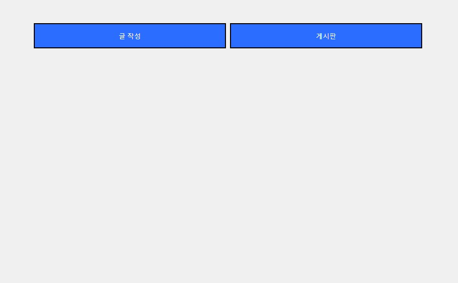
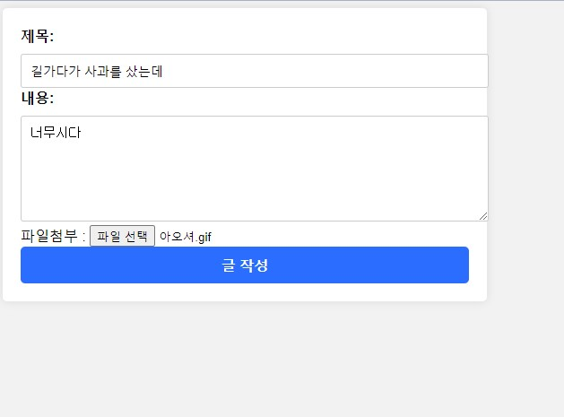
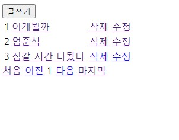
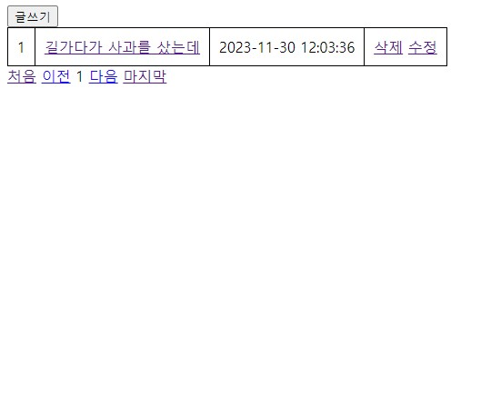
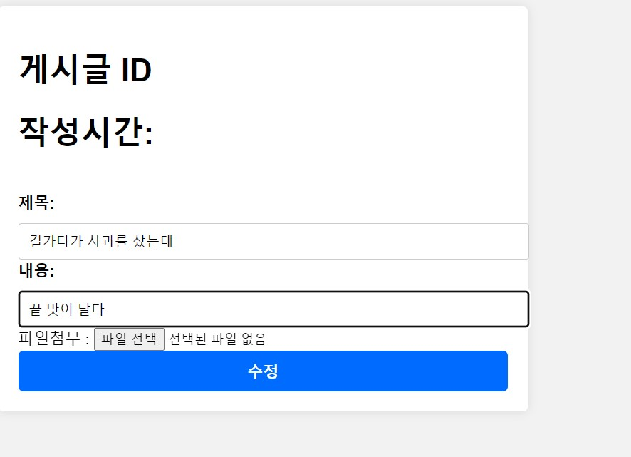
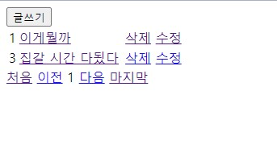

### Spring Boot -- Board Project (11/20 ~ 11/30)

---

스프링부트로 만든 게시판입니다.

#### __※ 개발환경__
  

 → IDE : InteliJ IDEA Community

 → Spring Boot 2.7.6

 → JDK 11

 → MySQL 8.0.35

 →  Spring Data JPA

 → Thymleaf
   
    

#### 주요기능(CRUD)
 → 1. 게시물 등록

 → 2. 게시물 수정

 → 3. 게시물 조회

 → 4. DB 저장

 → 5. 게시글 삭제
   
    

#### ☆ 수정 처리

1. 글삭제

2. 게시글 내용및 업데이트 시간 수정
3. 페이지 당 5개의 게시물 표시
4. 파일(이미지)첨부하기
5. 단일 파일 첨부
6. 다중 파일 첨부

  
   

__※ 향후 업데이트 예정 기능__
1. 댓글 수정 삭제

2. 실시간 채팅
...

 __제작 과정에 필요했던 지식__

1. CRUD 의 개념

 → 엔티티 등록

 → DB(MySQL)에 저장

 → CRUD 구현 클래스 작성
  

2. 스프링부트 어노테이션 사용

  → @RequestPharam, Model 등의 데이터 공유방안

  → CRUD구현 클래스에 사용되는 어노테이션(@Controller , @Service, @Getter....)

   

3. HTML과 스프링부트 간의 데이터 공유

  4. 자바 문법

    -데이터 타입

    -예외처리

    -람다식 활용
  ...

---

### __사용방법__
---

__1.실행을 누르고__

__2. [localhost:8080](http://localhost:8080/) 으로 들어가서__

    
__3. 글 작성를 누릅니다.__

    
__4. 정보를 입력하고 파일을 첨부하고__

    
__5. 그러면 자동으로 게시판으로 이동합니다.  그리고 삭제 수정이 가능합니다.__

    
__6. 요롷게__

    
__7. 수정시 제목,내용, 파일을 수정할 수 있습니다.__

    
__8. 댓글 작성도 가능합니다.__
  

---
__업데이트 내역__

-1.0.00 : 최초 버전: CRUD 구현(11/20 ~ 11/22)

-1.0.05 : 댓글 기능 구현 (11/23)

-1.0.05 : 파일 첨부 구현 (11/24)

-1.0.15 : view 시각화 업데이트 (11/26)

-1.0.20 : 게시글 파일 수정구현(11/26)

-13.0.25 : 댓글 저장시 게시글의 pk인식을 못하는 사항을  수정(11/27)
