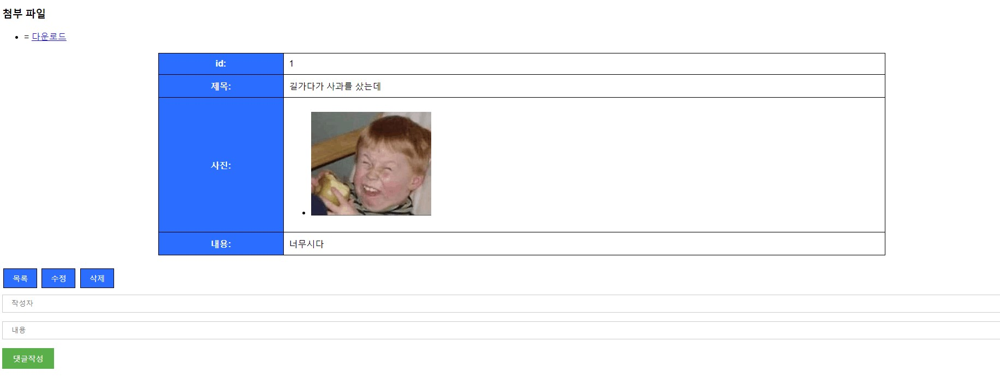

### 스프링부트를 이용한 게시판 만들기(11/20 ~ 11/30)

---

스프링부트로 만든 게시판입니다

__주요기능(CRUD)__
- 게시물 등록
- 게시물 수정
- 게시물 삭제
- 게시물 조회

- 파일(이미지) 첨부
- 댓글기능
- DB 저장

#### ※ 많이 허접해 보이지만 실제로 허접한 게시판입니다.####

  &nbsp;CRUD 구현과 엔티티및 DTO의 사용에 중점을 둔 결과물입니다.
이쁜 결과물에 대한 사항은 프론드 엔드측으로 문의해주세요

----
제작 과정에 필요했던 지식

1. CRUD 의 개념

 - 엔티티 등록
 - DB(MySQL)에 저장
 - CRUD 구현 클래스 작성

 2. 스프링부트 어노테이션 사용
  - @RequestPharam, Model 등의 데이터 공유방안
  - CRUD구현 클래스에 사용되는 어노테이션(@Controller , @Service, @Getter....)

  3. HTML과 스프링부트 간의 데이터 공유

  4. 자바 문법
 - 데이터 타입
 - 예외처리
 - 람다식 활용
  ...

### __사용방법__
---

__1. 실행을 누르고__

__2. [localhost:8080](http://localhost:8080/) 으로 들어가서__

  

__3. 쓰러가볼까?__ 
 
__4. 정보를 입력하고 파일을 첨부하고__ 

  

__5. 그러면 자동으로 게시판으로 이동합니다. 삭제 수정이 가능합니다.__ 

 

  

 

  

__5-1. 요롷게__

 __6. 들어가보면__

  

  

__7. 댓글 작성도 가능하지요__

  

  
