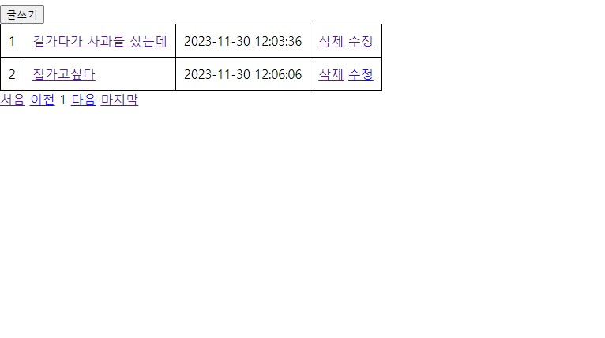
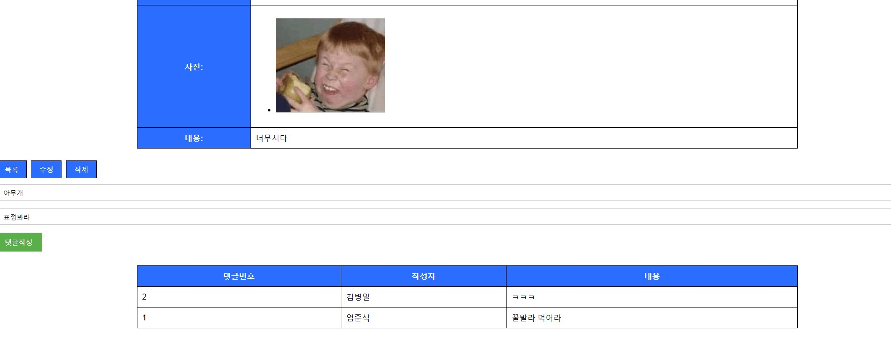

### 스프링부트를 이용한 게시판 만들기(11/20 ~ 11/30)

---

스프링부트로 만든 게시판입니다

#### __※ 개발환경__

- IDE : InteliJ IDEA Community
- Spring Boot 2.7.6
- JDK 11
- MySQL 8.0.35
- Spring Data JPA
- Thymleaf

#### 주요기능(CRUD)
- 1. 게시물 등록
- 2. 게시물 수정
- 3. 게시물 조회
 - 댓글달기
- 4. DB 저장
- 5. 게시글 삭제

#### ☆ 수정 처리
1. 글삭제
2. 페이징처리
3. 게시글 페이징
  - 페이지 당 5페이지
4. 파일(이미지)첨부하기
5. 단일 파일 첨부
6. 다중 파일 첨부

__※ 향후 업데이트 예정 기능__
1. 댓글 수정 삭제
2. 실시간 채팅
...

 __● 제작 과정에 필요했던 지식__

1. CRUD 의 개념

 - 엔티티 등록
 - DB(MySQL)에 저장
 - CRUD 구현 클래스 작성

 2. 스프링부트 어노테이션 사용
  - @RequestPharam, Model 등의 데이터 공유방안
  - CRUD구현 클래스에 사용되는 어노테이션(@Controller , @Service, @Getter....)

  3. HTML과 스프링부트 간의 데이터 공유

  4. 자바 문법
 - 데이터 타입
 - 예외처리
 - 람다식 활용
  ...

### __사용방법__
---

__1. 실행을 누르고__

__2. [localhost:8080](http://localhost:8080/) 으로 들어가서__

  

__3. 작성하기를 누릅니다.__ 
 
__4. 정보를 입력하고 파일을 첨부하고__ 

  

 __5. 그러면 자동으로 게시판으로 이동합니다. 삭제 수정이 가능합니다.__

  

 

__5-1. 요롷게__

  

 

__5-2. 수정시 제목,내용, 파일을 수정할 수 있습니다.__

  

 __6. 들어가보면__

  

  

__7. 댓글 작성도 가능합니다.__

  

  

__업데이트 내역__

- 1.0.00 : 최초 버전: CRUD 구현(11/20 ~ 11/22)

- 1.0.05 : 댓글 기능 구현 (11/23)

- 1.0.05 : 파일 첨부 구현 (11/24)

- 1.0.15 : view 시각화 업데이트 (11/26)
- 1.0.20 : 게시글 파일 수정구현(11/26)

- 13.0.25 : 댓글 저장시 게시글의 pk인식을 못하는 사항을  수정(11/27)
